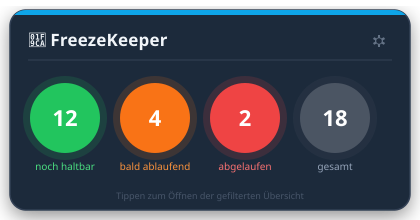
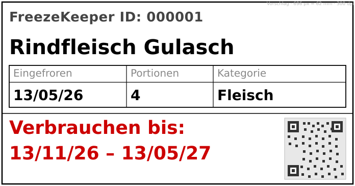

# FreezeKeeper


Home Assistant Custom Integration zur Verwaltung von Tiefkühlgut — mit automatischer Haltbarkeitskontrolle und Etikettendruck über einen Brother QL-820NWBc.

---

## Features

- **Neuaufnahme** — Gefriergut erfassen, Etiketten drucken (inkl. QR-Code)
- **Direktentnahme** — QR-Code auf dem Etikett mit der Handy-Kamera scannen, Entnahme wird sofort gebucht — ohne HA zu öffnen
- **Ampel-Dashboard** — kompaktes Widget mit Echtzeit-Bestandszählung nach Haltbarkeitsstatus
- **HA Panel** — vollständige UI als eigenes HA-Sidebar-Panel (`/freezekeeper`), isoliert von HA-Keyboard-Shortcuts
- **Bestandsübersicht** — vollständige, filterbare und sortierbare Tabelle aller Einträge
- **Ablaufwarnung** — automatischer Statuswechsel grün → orange → rot basierend auf min/max Haltbarkeit pro Kategorie
- **Etiketten-Nachdruck** — Einzel- oder Bulk-Nachdruck direkt aus der Bestandsübersicht
- **Konfigurierbar** — Kategorien, Gefriereinheiten, Drucker-Einstellungen über das ⚙-Icon im Widget



---

## Ampellogik

| Status | Bedingung |
|--------|-----------|
| 🟢 Noch haltbar | Heute < MHD_min |
| 🟠 Verbrauchsfenster | MHD_min ≤ Heute ≤ MHD_max |
| 🔴 Abgelaufen | Heute > MHD_max |

MHD_min und MHD_max werden aus Einfrierdatum + Kategorie-Haltbarkeit berechnet.

---

## Hardware

| Komponente | Modell |
|------------|--------|
| Etikettendrucker | Brother QL-820NWBc (62 mm, 2-Farb-Druck) |
| Steuerung | Home Assistant (beliebige Installation) |

---

## Etikett



Der QR-Code enthält eine Webhook-URL zur direkten Entnahme-Buchung per Handy-Kamera.

---

## Installation

### Voraussetzungen

- Home Assistant (beliebige Installationsmethode)
- Brother QL-820NWBc, per WLAN oder USB erreichbar
- Python-Abhängigkeiten werden von HA automatisch installiert (`brother_ql`, `qrcode`, `pillow`, `python-barcode`)

---

### Installation via HACS (empfohlen)

[HACS](https://hacs.xyz) installiert die Integration und die Lovelace-Karte automatisch.

1. HACS öffnen → **⋮ → Benutzerdefinierte Repositories**
2. URL: `https://github.com/piep-projects/FreezeKeeper` · Kategorie: **Integration** → Hinzufügen
3. In HACS unter **Integrationen** nach **FreezeKeeper** suchen → installieren
4. Home Assistant neu starten
5. Integration einrichten (siehe Schritt 5 unten)
6. Karte zum Dashboard hinzufügen (siehe Schritt 6 unten)

> Beim ersten Start werden `freezekeeper-card.js` und `freezekeeper-panel.html` automatisch nach `config/www/` kopiert. Die Lovelace-Ressource und das Sidebar-Panel `/freezekeeper` werden automatisch registriert — kein manueller Schritt nötig.

---

### Manuelle Installation

### 1 — Integration kopieren

Kopiere den Ordner `custom_components/freezekeeper/` in das Verzeichnis `config/custom_components/` deiner HA-Installation:

```
config/
└── custom_components/
    └── freezekeeper/       ← dieser Ordner
        ├── __init__.py
        ├── manifest.json
        └── …
```

**Typische Zugriffswege:**

| Methode | Pfad |
|---------|------|
| Samba / Netzlaufwerk (Mac) | `/Volumes/config/custom_components/` |
| SSH / Terminal | `/root/config/custom_components/` |
| HA File Editor Add-on | `/config/custom_components/` |

### 2 — Lovelace-Karte kopieren

Kopiere `www/freezekeeper-card.js` in das Verzeichnis `config/www/` deiner HA-Installation (Ordner `www` ggf. anlegen):

```
config/
└── www/
    └── freezekeeper-card.js
```

### 3 — Lovelace-Ressource registrieren

> Bei manueller Installation ist dieser Schritt erforderlich. Bei HACS-Installation entfällt er — die Ressource wird automatisch registriert.

1. Öffne in HA: **Einstellungen → Dashboards → oben rechts ⋮ → Ressourcen**
2. Klicke auf **＋ Ressource hinzufügen**
3. URL: `/local/freezekeeper-card.js`
4. Ressourcentyp: **JavaScript-Modul**
5. Speichern

> Falls der Menüpunkt „Ressourcen" nicht sichtbar ist: **Einstellungen → Dashboards → Erweiterte Einstellungen aktivieren** (oben rechts).

### 4 — Home Assistant neu starten

**Einstellungen → System → Neu starten**

### 5 — Integration einrichten

1. **Einstellungen → Geräte & Dienste → Integration hinzufügen**
2. Suche nach **FreezeKeeper**
3. Drucker-URL eingeben (z. B. `tcp://192.168.1.50` für WLAN)
4. Etikettentyp, 1D-Barcode-Option und ggf. HA Basis-URL einstellen
5. Speichern — die Integration startet und legt den Sensor `sensor.freezekeeper` an

### 6 — Karte zum Dashboard hinzufügen

1. Dashboard öffnen → **Bearbeiten → Karte hinzufügen**
2. Ganz nach unten scrollen → **Manuelle Karte** auswählen
3. Folgenden YAML-Code eingeben:

```yaml
type: custom:freezekeeper-card
```

4. Speichern

Die FreezeKeeper-Karte erscheint nun im Dashboard.

---

## Dokumentation

| Dokument | Inhalt |
|----------|--------|
| [`HANDBUCH.md`](HANDBUCH.md) | Benutzerhandbuch (Bedienung, Schritt-für-Schritt) |
| [`FDS.md`](FDS.md) | Functional Design Specification (vollständige Spezifikation) |
| [`MOCKUPS.md`](MOCKUPS.md) | ASCII-Mockups aller UI-Screens |
| [`PROJECT_IDEA.md`](PROJECT_IDEA.md) | Projektkonzept, Kategorieliste, Abläufe |
| [`mockup_dashboard_widget.svg`](mockup_dashboard_widget.svg) | Visueller Mockup des Dashboard-Widgets |

---

## Konfiguration

| Parameter | Beschreibung |
|-----------|--------------|
| **Drucker-URL** | `tcp://192.168.x.x` (WLAN) oder `usb://0x04f9:0x209b/…` (USB) |
| **Etikettenbreite** | 62 mm – DK-22205 (Endlos) oder DK-22251 (2-farbig) |
| **1D-Barcode** | Aktiviert zusätzlichen Code-128-Barcode für Handscanner |
| **HA Basis-URL** | Nur nötig wenn die URL nicht automatisch erkannt wird (z. B. bei Docker/Proxy). Wird für den QR-Code-Webhook verwendet. Beispiel: `http://homeassistant.local:8123` |

---

## Status

> In Betrieb — v0.2.3

---

## Lizenz

MIT License — Copyright (c) 2026 piep-projects
